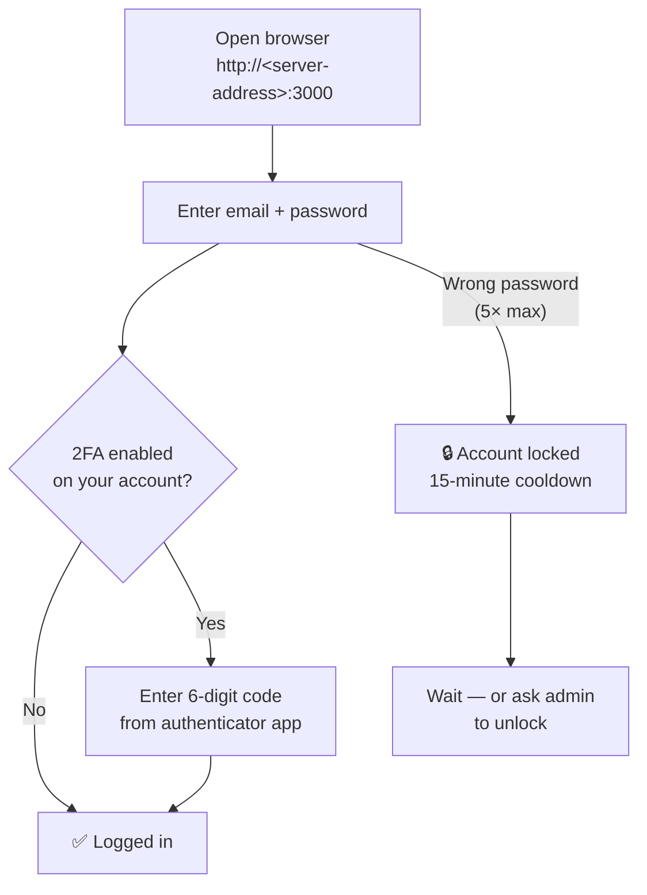
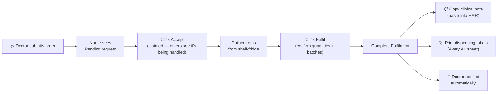
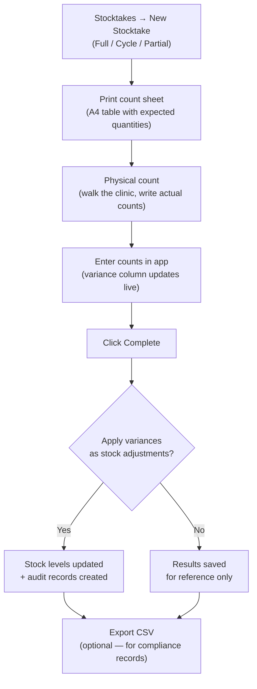

# S.H.I.T. — User Guide

Step-by-step instructions for every role. No technical knowledge required.

---

## Table of Contents

- [Logging In](#logging-in)
- [My Account (All Roles)](#my-account-all-roles)
- [Guide for Admins](#guide-for-admins)
- [Guide for Doctors](#guide-for-doctors)
- [Guide for Nurses](#guide-for-nurses)
- [Common Tasks (All Roles)](#common-tasks-all-roles)

---

## Logging In



1. Open a browser on any device connected to the clinic network
2. Go to `http://<server-address>:3000` (your admin will provide this)
3. Enter your email and password
4. If 2FA is enabled on your account, enter the 6-digit code from your authenticator app after your password

**Locked out?** Accounts lock for 15 minutes after 5 incorrect attempts. Wait, or ask an admin.  
**Forgotten password?** Ask your admin to set a temporary password.  
**Idle timeout:** The system logs you out after 30 minutes of inactivity, with a 2-minute warning.

---

## My Account (All Roles)

Click your name in the bottom-left of the sidebar to open **My Account**.

### Profile
- Change your **display name** and **email address**
- Click **Save changes** — takes effect immediately

### Appearance
- **Dark mode** toggle — switches the entire interface to a dark theme
- **Accent colour** — choose from 8 presets or pick any custom colour; changes buttons, active navigation, and highlights throughout the app

### Notifications
- **Notification sound** — toggle the chime that plays when a new request or receipt arrives

### Security — Two-Factor Authentication (2FA)
1. Click **Enable 2FA**
2. Open Google Authenticator, Authy, or any TOTP app on your phone
3. Scan the QR code (or type the secret key manually if you can't scan)
4. Enter the 6-digit code to confirm setup
5. All future logins will require your password **plus** a code from the app

To disable 2FA: click **Disable**, enter a current authenticator code to confirm.

### Security — Change Password
Click **Change password** to go to the password change screen.

---

## Guide for Admins

Admins have access to everything. This section covers admin-only tasks.

### Managing Users

**Create a new user:**
1. Go to **Users → Add User**
2. Enter name, email, role (Admin / Doctor / Nurse)
3. Set a temporary password — the user must change it on first login
4. Click **Create**

**Deactivate a user** (staff member left):
1. Users → Edit (pencil) → toggle **Active** off → Save
2. The user can no longer log in; all history is preserved

**Reset a forgotten password:**
Users → find user → **Reset Password** → set a temporary password → the user must change it on next login

### Setting Up Email Notifications

Configure email directly from **Settings → Email (SMTP)** — no file editing required:

1. Go to **Settings → Email (SMTP)**
2. Enter your SMTP host, port, username, and password
3. Set the **From Address** (e.g. `S.H.I.T. <noreply@yourclinic.com>`)
4. Set the **App URL** to your server's address (used in email links, e.g. `http://192.168.1.100:3000`)
5. Click **Save all changes**
6. Click **Send Test Email** to verify — a test message is sent to your account immediately

**Common provider settings:**
| Provider | Host | Port |
|---|---|---|
| Gmail (App Password) | `smtp.gmail.com` | `587` |
| Outlook / Microsoft 365 | `smtp.office365.com` | `587` |
| SendGrid | `smtp.sendgrid.net` | `587` |

Once configured, the system automatically sends:
- New request notifications to nurses
- Fulfilment receipts to doctors
- Account lockout and after-hours login alerts to admins
- Weekly usage + low stock reports every Monday 8am
- Expiry alerts for batches nearing their use-by date
- Recall notifications to admins
- Backup success/failure notifications (if backup enabled)

### Configuring Security Settings

**Settings → Security** — adjust without restarting the server:
- **Session timeout** — how many idle minutes before automatic sign-out (default: 30)
- **Max login attempts** — failed logins before account lockout (default: 5)
- **Lockout duration** — how long accounts stay locked in minutes (default: 15)

### Setting the Timezone

**Settings → Timezone** — enter an IANA timezone string (e.g. `Australia/Sydney`, `America/New_York`, `Europe/London`).

This controls the time at which all scheduled jobs fire: weekly reports, expiry alerts, backup, retention, and stocktake creation.

### Automatic Database Backups

**Settings → Automatic Database Backup:**
1. Toggle **Enable automatic backups**
2. Choose **Daily** (runs at 2:00 AM) or **Weekly** (runs Sunday at 2:00 AM)
3. Enter how many days to keep old backups
4. Enter the backup directory path (Linux: `/opt/medinv/backups`; WSL: `~/medical-inventory/backups`)
5. Click **Save all changes**

Click **Run Backup Now** at any time to create an immediate manual backup. The file list below the button shows existing backups with sizes.

**Windows users:** Use the included `backup.ps1` script with Task Scheduler for an additional off-machine copy — see the Deployment Guide.

### Managing Categories and Suppliers

Go to **Settings** and use the **Categories** and **Suppliers** sections. Categories have a colour used throughout the app for visual grouping. Suppliers can be deactivated (archived) rather than deleted.

### Adding Inventory Items

1. **Inventory → Add Item**
2. Key fields:
   - **Unit** — how the item is measured (tablet, mL, unit, box)
   - **Internal Price** — what you charge per unit (used in billing totals)
   - **Reorder Threshold** — triggers the low-stock alert on the dashboard
   - **Dispense Step** — controls the +/− increment on the POS ordering screens (e.g., `5` for items sold in packs of 5)
   - **Storage Location** — free text (e.g., "Fridge 2", "Cabinet A-3")
   - **Requires Batch/Lot Tracking** — if enabled, nurses must specify a batch when fulfilling
   - **Controlled Drug** — tick if the item is a Schedule 4 or Schedule 8 substance; select the schedule code
   - **Auto Reorder** — tick to automatically create a draft purchase order when stock hits the threshold
   - **Reorder Quantity** — how much to order when auto-reorder triggers (default: 2× the reorder threshold)
3. Save

### Adding Item Photos

A photo helps nursing staff identify the correct item on the shelf, especially for similar-looking medications.

1. **Inventory → find item → Edit (pencil icon)**
2. Scroll to the **Photo** section
3. Upload a JPEG, PNG, or WebP image (max 20 MB)
4. Click **Save** — the photo is stored in the uploads volume and shown on the item card

### Adjusting Stock Manually

Inventory → find item → **Adjust** (bar chart icon):
- **Types:** Increase, Decrease, Correction, Damage, Expiry, Return, Wastage, Other
- Enter quantity and a required reason — recorded permanently in the audit log

### Recording Wastage

For stock lost without being used on a patient:

1. Inventory → find item → click the **bin icon**
2. Enter quantity wasted
3. Select reason: Dropped / Contaminated / Opened but unused / Incorrect dose drawn / Expired after opening / Other
4. Click **Record Wastage**

View wastage history and costs at **Reports → Wastage**.

### Returns to Supplier

1. **Returns → New Return**
2. Select or type the supplier name
3. Add line items — search for the item, enter batch number, quantity, and reason
4. Click **Create Draft**
5. When ready: click **Confirm** on the return row → stock levels are restored automatically

### Setting Monthly Budgets

The dashboard shows a budget vs actual spend widget. To configure budgets:
- Use the API: `PUT /api/budgets` with `{ category_id, period_month: "YYYY-MM", budget_amount }`
- Or use the budget management UI (if set up in Settings)

### Recording Supplier Invoices

1. **Invoices → New Invoice**
2. Enter invoice number, supplier, and date
3. Add line items — link each to an existing inventory item, enter batch info, quantity, unit cost
4. GST calculated automatically
5. **Post** the invoice → stock levels update for all linked items
6. Posted invoices cannot be edited

**Xero export:** `GET /api/invoices/xero-export?from=YYYY-MM-DD&to=YYYY-MM-DD` returns a Xero bank transactions CSV.

### Running Reports

**Reports** page tabs:
- **Overview** — dashboard-style summary
- **Usage** — items dispensed over a date range; group by item/doctor/nurse/category; weekly/monthly trend charts
- **Wastage** — all wastage adjustments with cost estimates and reason breakdown
- **Patient Ledger** — search by patient name or reference, see all charges
- **Expiring** — batches expiring within a configurable number of days
- **Low Stock** — items at or below reorder threshold
- **Valuation** — total stock value at internal and cost prices
- **Movements** — full adjustment history
- **Invoices** — invoice line items CSV export
- **BAS / GST** — Australian quarterly BAS summary (see [GST / BAS Export](#gst--bas-export) below)
- **Controlled Drug Register** — all dispensing events for controlled/scheduled items, CSV export

All tabs support date ranges and CSV export.

### Viewing the Audit Log

**Audit Log** records every significant action — who, what, when, before/after values. Use the search and date filter to investigate specific events. The log is append-only; no user can delete records.

### Purchase Orders

**Raise a purchase order:**
1. Go to **Purchase Orders → New Order**
2. Enter the supplier name (matches existing suppliers), expected date, and notes
3. Add line items — item name, quantity, and unit cost
4. Click **Create Order** (status: Draft)
5. When ready to send: open the order → **Mark as Sent**
   - If the supplier has an email address on file, the PO is emailed to them automatically

**Receiving stock against a PO:**
1. Open the PO → **Record Receipt**
2. Enter quantity received, batch number, and expiry date for each line
3. Click **Record Receipt** — stock levels are updated and adjustment records are created
4. Partially received orders show status **Partial**; further receipts accumulate

**Attachments:** Drag and drop PDF/image/CSV files onto any PO, invoice, or return to attach them for record-keeping.

### Session Management

**My Account → Sessions:** Shows all your active login sessions (device, IP, last seen).
- Click **Revoke** next to any session to force a sign-out from that device
- Click **Sign out everywhere** to revoke all sessions at once

**Admin — revoking a user's sessions:**
Users → find user → **Revoke All Sessions** — immediately invalidates all their tokens.

### Managing Sites (Multi-location)

**Settings → Sites:**
- Add clinic locations (name, address, phone, email)
- Assign staff and inventory items to a site for per-location filtering and reporting
- The default "Main Clinic" cannot be deleted

### Data Retention

**Settings → Data Retention:**
| Setting | Default | Notes |
|---|---|---|
| Audit log retain | 7 years | Records older than this move to archive nightly |
| Patient data retain | 7 years | How long patient names/refs are kept |
| Anonymise patient refs | Off | When on: automatically replaces names with [Anonymised] |

Click **Run Now** to trigger the retention job immediately (useful after first configuration).

The **Database Size** tab shows current table sizes to help plan for future growth.

### Controlled Drug Register

For clinics using Schedule 8 (or S4) drugs:
- Mark items as **Controlled** when adding/editing them; set the schedule (S4, S8, etc.)
- When a nurse fulfils a controlled drug, they must enter a **witness name and role**
- Go to **Reports → Controlled Drug Register** to view or export the full dispensing history (CSV) for regulatory compliance

### Recall Management

When a supplier issues a product recall:

1. **Recalls → New Recall**
2. Enter the recall title, description, affected batch numbers (comma-separated), and severity level
3. Optionally enter a regulatory reference (TGA recall number, ARTG, etc.)
4. Click **Create Recall** — admins are emailed immediately with a severity-coded alert

**Inside the recall detail view:**
- **Affected batches in stock** — lists every matching batch still on your shelves with current quantity
- **Dispensed to patients** — every dispensing event matching those batch numbers, with patient name, date, and doctor
- **Quarantine Affected Stock** — writes off all matching batches in one click and creates adjustment records
- **Export Patient List (CSV)** — download the full patient impact list for regulatory submission
- **Close Recall** — marks it as resolved

### GST / BAS Export

**Reports → BAS / GST** generates an Australian BAS summary:

| Field | Source |
|---|---|
| Taxable purchases (incl. GST) | Posted supplier invoices in the date range |
| Input tax credits (G10/G11) | GST component of those invoices |
| Taxable supplies | Dispensing charges with GST-applicable items |
| GST collected | GST component of those charges |
| **Net GST payable** | GST collected − input tax credits |

- Use the **From / To** date pickers to select the BAS quarter
- Defaults to the current Australian financial year
- Click **Export CSV** to download for your accountant or BAS agent
- Monthly breakdown table shows the split for each month in the period

### Outbound Webhooks

Push real-time events to external systems (practice management software, Zapier, custom scripts):

1. **Settings → Webhooks → New Webhook**
2. Enter the destination URL and select which events to subscribe to
3. Copy the **signing secret** — it is shown only once; use it in your receiver to verify the signature
4. Click **Test** to send a ping and confirm the connection

**Verifying signatures (in your receiver):**
```
X-SHIT-Signature: sha256=<hmac>
Compute: HMAC-SHA256(secret, request_body)
Compare: computed == header value
```

**Available events:**

| Event | Triggered when |
|---|---|
| `stock.low` | Stock hits the reorder threshold (and auto-reorder creates a PO) |
| `stock.expired` | Nightly write-off runs and finds expired batches |
| `request.created` | A doctor submits a new stock request |
| `request.fulfilled` | A nurse fulfils a request |
| `invoice.posted` | A supplier invoice is posted and stock is updated |
| `purchase_order.received` | Goods are received against a purchase order |
| `stocktake.completed` | A stocktake session is completed |
| `recall.created` | A new recall is logged |
| `transfer.received` | A stock transfer is received at the destination site |

Failed deliveries are automatically retried with exponential backoff (1 min → 5 min → 30 min → 2 h → 8 h). The **Deliveries** tab shows the history and response codes for each subscription.

### Scheduled Stocktake Configuration

Set up recurring stocktakes so sessions are created automatically:

1. **Settings → Stocktake Schedules → New Schedule**
2. Set the name, frequency (Weekly / Monthly / Quarterly), and the day within the period
3. Choose **Full** (all active items) or **Partial** (by category or location)
4. Add any extra email addresses to notify when a session is created
5. Click **Save** — the system calculates the next due date and creates the session automatically when that date arrives

Staff receive an email with the session details. They log in and count as normal.

### Running a Stocktake

See [Stocktake Workflow](#stocktake-workflow) below.

---

## Guide for Doctors

### Placing a Stock Order (New Order screen)

1. Go to **New Order** in the sidebar
2. Browse or search items — type any part of the name, SKU, or category
3. Use **category filter pills** to narrow the grid
4. Tap an item to add it to the order; tap again to increase by the dispense step
5. Use **− / +** in the right panel to fine-tune quantities
6. Set the **Priority** (Low / Normal / High / Urgent) — Urgent sorts to the top of the nurse queue
7. Enter patient name and reference if needed
8. Add any notes for nurses
9. Click **Send to Nurses**

All active nurses are notified (in-browser notification + email if configured).

### Using Templates

Save time on recurring orders:

**Save a template:**
1. Build your basket as usual
2. Type a name in the template box at the bottom of the checkout panel
3. Click the **save icon**

**Load a template:**
1. Click **Load Template**
2. Select from your saved templates — the basket is replaced with the template contents
3. Adjust quantities if needed, then send

Templates are private to your account.

### Barcode Scanning

Connect a USB or Bluetooth barcode scanner. While on the New Order screen, scan any item — it is added to the basket automatically without needing to search.

### Tracking Your Requests

Go to **Requests** to see all your orders:
- **Pending** — waiting for a nurse
- **Accepted** — a nurse has claimed it
- **Fulfilled** — dispensed; click to see the full receipt with batch numbers and charges

### Understanding Quick-Charge Receipts

Nurses can charge stock directly to you without a prior request (e.g., during a consultation). These appear in your Requests list with a `QC-` prefix. Click any receipt to see what was dispensed.

### Reports

**Reports** shows usage data for requests you've raised. Use the date range and group-by options to see patterns.

---

## Guide for Nurses

### Request Fulfilment Workflow



### Viewing Requests

Go to **Requests** — new requests from doctors appear at the top, sorted by priority (Urgent first).

### Accepting and Fulfilling a Request

1. Click a pending request to open it
2. Click **Accept** — other nurses see it's being handled (moves to `Accepted`)
3. Click **Fulfil** when you have the items:
   - Confirm quantities (adjust if short)
   - Click **Load batches** for batch-tracked items — the system auto-selects the earliest expiring batch (FEFO)
   - Tick **This is a substitution** if you used a different item, and enter a reason
4. Click **Complete Fulfilment**

After fulfilling, two things appear below the fulfilment receipt:

**Copyable clinical note** — a green panel with:
```
Stock used
3x Amoxicillin 500mg
1x Gauze Roll 10cm
```
Click **Copy** to paste directly into your clinical notes system.

**🏷️ Print Labels** — opens an A4 PDF sheet of adhesive dispensing labels (Avery L7163 / 99×57mm, 10 per page). Each label contains:
- Practice name
- Patient name and reference number
- Drug name and quantity dispensed
- Batch number and expiry date
- Dispensing nurse name and date

Click the button and print from your browser. Labels work with standard adhesive label sheets.

### Quick Charge (POS screen)

For administering stock during a consultation without a prior doctor request:

1. Go to **Quick Charge** in the sidebar
2. Use the search bar or category pills to find items; tap to add
3. **Barcode scanner** — scan any item to add it instantly
4. Select the **Doctor** from the dropdown
5. Enter patient name/reference if needed
6. Click **Send Receipt to Doctor** — stock deducted, doctor receives notification

### Using Charge Templates

Save common charge baskets as templates so you don't have to search for the same items every time:

**Save a template:**
1. Build your basket (e.g., wound dressing items)
2. Type a name in the template name box at the bottom of the checkout panel
3. Click the **save icon** — the template is saved to your account

**Load a template:**
1. Click **Load Template**
2. Pick from your saved templates — the basket is populated instantly
3. Adjust quantities if needed, then send

Useful templates:
- "Flu clinic" — vaccines + syringes + swabs
- "Wound dressing" — gauze, tape, antiseptic
- "IV line setup" — cannula, saline, giving set

### Recording Wastage

When stock is lost without being used on a patient:

1. Go to **Inventory**
2. Find the item → click the **bin icon** (Record Wastage)
3. Enter the quantity wasted
4. Select the reason
5. Optionally select the batch
6. Click **Record Wastage**

This is important for accurate stock management and compliance records.

### Running a Stocktake

See [Stocktake Workflow](#stocktake-workflow) below.

---

## Common Tasks (All Roles)

### Stocktake Workflow



#### 1. Create the session

**Stocktakes → New Stocktake:**
- **Full** — counts every active item
- **Cycle** — rotating subset (same as Full but for partial runs)
- **Partial** — filter by category or storage location

#### 2. Print the count sheet

- From the stocktake list: click the **printer icon** on any session row
- Or inside the session: click **Count Sheet**

A new browser tab opens with an A4-formatted table showing expected quantities and blank "Counted" columns. Click the **Print** button.

#### 3. Count physically

Walk the clinic with the printed sheet. Write actual counts next to each item.

#### 4. Enter counts

Open the session from the Stocktakes list. Type the counted quantity for each item. The **Variance** column updates automatically (positive = more than expected, negative = less).

Use **Filter uncounted** to focus on remaining items. Use the search bar to find specific items.

#### 5. Complete

Click **Complete**. Choose whether to apply variances as stock adjustments:
- **Yes** — updates `quantity_on_hand` for all items with variance; each creates an audit record
- **No** — saves results for reference without changing stock levels

#### 6. Export (optional)

Click **Export CSV** on the completed session for compliance records.

### Searching for Items

The fuzzy search on the Inventory page, New Order screen, and Quick Charge screen:
- Searches name, SKU, barcode, category, and unit
- Space-separated words all must match — `amox 500` finds "Amoxicillin 500mg" but not "Amoxicillin 250mg"
- Case-insensitive; partial matches work
- Results ranked — name-starts-with matches appear first

### Barcode Scanner (POS & Inventory)

Connect a USB or Bluetooth scanner. While on the New Order or Quick Charge screen (with focus outside a text box), scan any barcode. The app detects the rapid keystroke pattern and:
- Adds the item directly to the basket if found by barcode or SKU
- Falls back to the search box if not found

### Keyboard Shortcuts

| Key | Action |
|-----|--------|
| `/` | Focus the search bar |
| `N` | Open new item / order / request |
| `Esc` | Close any open modal |
| `?` | Show keyboard shortcut help |

Shortcuts do nothing when you're typing inside a form field.

### Installing the App on a Phone or Tablet

Visit the app in your mobile browser:
- **Android (Chrome):** tap the menu → "Add to Home screen"
- **iPhone (Safari):** tap the share button → "Add to Home Screen"
- **Desktop (Chrome/Edge):** click the install icon in the address bar

The app then runs full-screen without browser chrome, with home screen shortcuts to Quick Charge and New Order.

### Changing Your Password

Sidebar → your name (bottom-left) → **My Account** → **Change password**.

Or navigate directly to `/change-password`.

Password requirements: minimum 8 characters with at least one uppercase letter, one lowercase letter, and one number.
